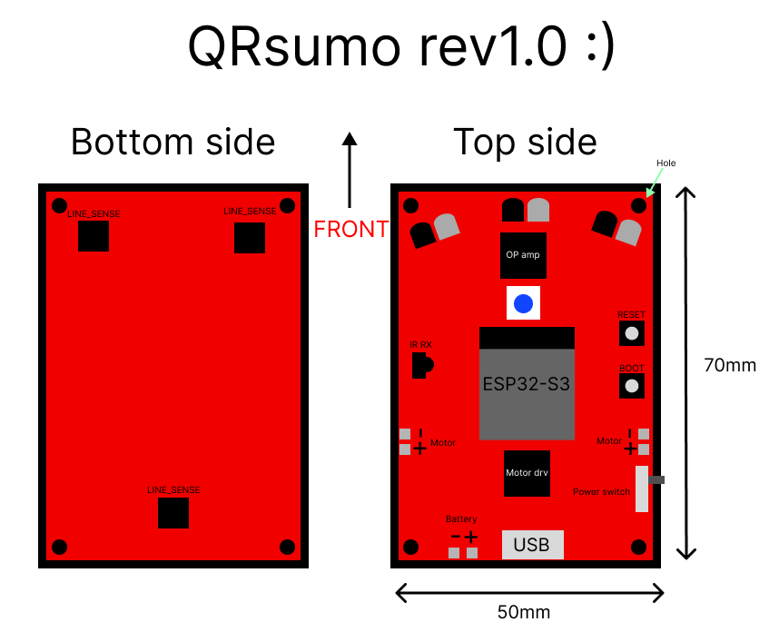

# QRsumo

QRsumo is a really cool sumorobot :)

Look out for more!

## Installation instructions
```
git clone https://github.com/victorhook/QRsumo.git
git submodule init && cd kicad-libraries && git submodule update --recursive
```

## Schematic
